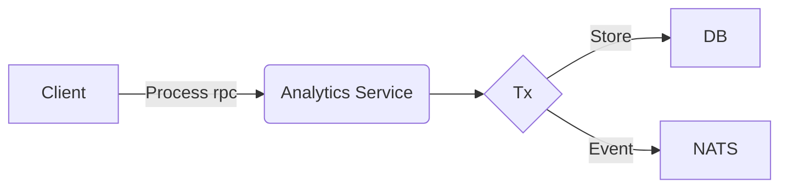

# Dualwrites

A small test playground to mess around with NATS event propagation on DB transactions.

### Design



### Dev shell

```shell
nix develop
```

### Commands

```shell
just up # Setup local deployment
just down # Tear down local deployment
just docker-build # Build source and local image
just infra-up # spin up a namespace and deployment
just infra-down # teardown namespace and deployment
just infra-restart # restart the namespace and deployment
just grpc-list # list service operations locally
just grpc-request # test a request locally
just k8s-request # test a request on the local k8s pod
just nats-connect # connect to the NATS pod
```

### Local testing

```
cargo run
just grpc-request
```

### k8s testing
```
just up
just k8s-request
just down
```

### NATS pod testing
```
just up
just nats-connect
nats pub --context localhost events.test "testing pod"
just down
```
