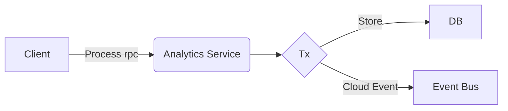

# Dualwrites

A small test service to mess around with a POC for a dual writes pattern and some arbitrary storage layer.
Was mainly looking for something to play around with a locally deployed NATS server in k8s.

The idea is to explore a sidecar for processing analytics related to another service through a small gRPC interface.

### Design



Tech used:

- gRPC
- NATS
- CloudEvents

### Dev shell

```shell
nix develop
```

### Commands

```shell
just up # Setup local deployment
just down # Tear down local deployment
just docker-build # Build source and local image
just infra-up # spin up a namespace and deployment
just infra-down # teardown namespace and deployment
just infra-restart # restart the namespace and deployment
just grpc-list # list service operations locally
just grpc-request # test a request locally
just k8s-request # test a request on the local k8s pod
just nats-connect # connect to the NATS pod
```

### Local testing

```shell
cargo run
just grpc-request
```

### k8s testing

```shell
just up
just k8s-request
just down
```

### NATS pod testing

```shell
just up
just nats-connect
nats pub --context localhost events.test "testing pod"
just down
```

### NATS event debugging

```shell
just up
just k8s-request
k get pods
k logs <nats-pod-name>
just down
```
